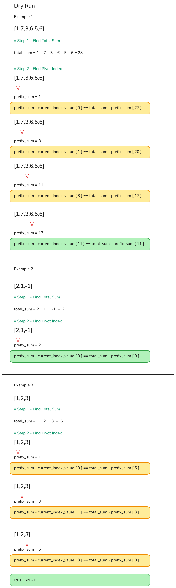

# 724. Find Pivot Index
### Question description.
- Given an array of integers nums, calculate the pivot index of this array.
- The pivot index is the index where the sum of all the numbers strictly to the left of the index is equal to the sum of all the numbers strictly to the index's right.
- If the index is on the left edge of the array, then the left sum is 0 because there are no elements to the left. This also applies to the right edge of the array.
- Return the **leftmost** pivot index. If no such index exists, return -1.
#### Example 1:
```
Input: nums = [1,7,3,6,5,6]
Output: 3
Explanation:
The pivot index is 3.
Left sum = nums[0] + nums[1] + nums[2] = 1 + 7 + 3 = 11
Right sum = nums[4] + nums[5] = 5 + 6 = 11
```
#### Example 2:
```
Input: nums = [1,2,3]
Output: -1
Explanation:
There is no index that satisfies the conditions in the problem statement.
```
#### Example 3:
```
Input: nums = [2,1,-1]
Output: 0
Explanation:
The pivot index is 0.
Left sum = 0 (no elements to the left of index 0)
Right sum = nums[1] + nums[2] = 1 + -1 = 0
```
### Topic
Prefix Sum
### Solution Summary
- **Total Sum:** The pivot index requires knowledge of the total sum of the array to compare left and right sums.
- **Left and Right Sums:** The left sum can be derived from the prefix sum up to the current index, while the right sum can be calculated as the total sum minus the prefix sum.
- **Equality Condition:** For an index to be a pivot, the left sum (elements before the index) must equal the right sum (elements after the index).
- The code uses a running total called **prefixSum**, which keeps track of the sum of elements from the start of the array up to the current index. This helps in determining the left sum and the right sum at each index.
### Dry Run

### Time Complexity
O(N) - where n is the length of the array, since the algorithm consists of two separate loops over the array.
### Space Complexity
O(1) - as it uses a fixed amount of extra space for variables, regardless of the input size.
